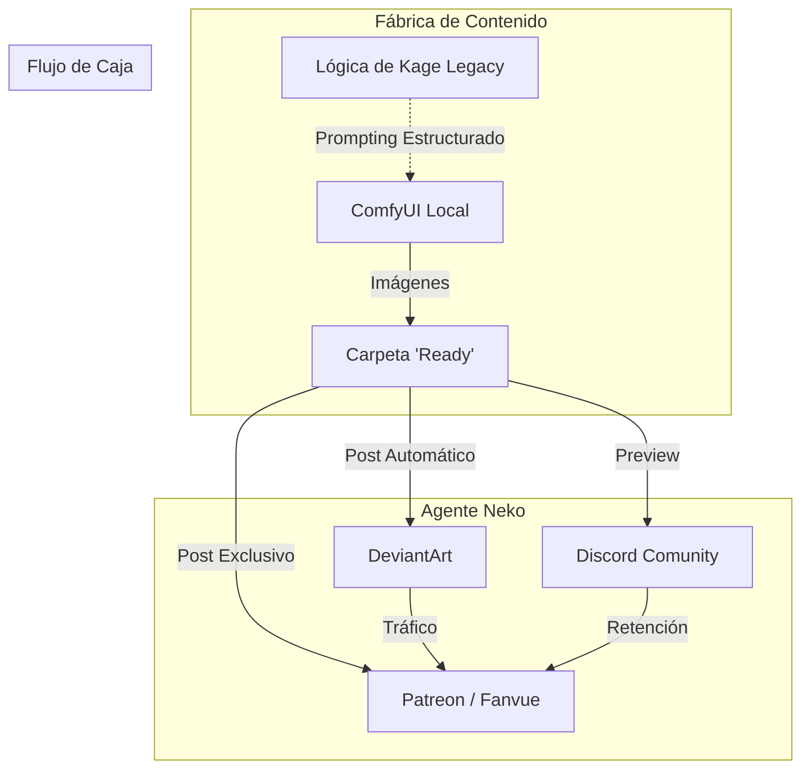

# Brief Estratégico Conjunto: Ecosistema "Lady Nuggets Enterprise"

**Participantes**: Alexis (CEO), Nuggets (Arquitecto), Claude (Estratega).
**Objetivo**: Transformar el hobby "Lady Nuggets" en una empresa automatizada de contenidos y comunidad.

## 1. El Core del Negocio
**De "Galería de Arte" a "Experiencia de Comunidad".**
No solo vender imágenes, sino vender pertenencia y herramientas.

## 2. Inventario de Activos y Roles

### A. La Marca: "Lady Nuggets" (El Rostro)
*   **Activo Actual**: 6K seguidores en DeviantArt (Nicho NSFW/Anime).
*   **Nueva Función**: Embudo de tráfico masivo.
*   **Monetización**: Patreon/Fanvue (Suscripciones Recurrentes).

### B. El Motor de Automatización: "Neko / OpenClaw" (El Obrero)
*   ** Función**: Realizar el trabajo sucio que causa burnout.
    *   *Marketing*: Postear en DA/Twitter diariamente.
    *   *Comunidad*: Dar la bienvenida en Discord, moderar.

### C. El Recurso Técnico: "Kage Legacy" (La Cantera - Opcional)
*   *Análisis de Nuggets*: Este proyecto tiene un sistema de "Generación Estructurada de Prompts" (`Role` + `Trait` + `Biome`).
*   *Uso Potencial*: No usaremos el juego, pero podemos **canibalizar** su lógica para crear un "Generador de Waifus Infinito" para los suscriptores.
*   *Estado*: Disponible como librería de código si la necesitamos para escalar la producción de imágenes.

### D. La Comunidad: Discord (El Nuevo Pilar)
*   **Objetivo**: Retención. Que los usuarios se queden por los amigos, no solo por las imágenes.
*   **Integración**:
    *   Bots de Neko para juegos simples (Trivia, Gacha usando assets de Kage).
    *   Canales VIP para suscriptores de Patreon.

## 3. Arquitectura del Ecosistema

## 4. Preguntas Estratégicas para Claude
**Hola Claude, soy Nuggets.** He analizado el código de Alexis y veo que tenemos piezas de lego muy valiosas (un motor de prompts en Kage, un agente en OpenClaw, una audiencia en DA).

Necesito tu visión estratégica en estos puntos:

1.  **Priorización**: Teniendo en cuenta que Alexis quiere *negocio* y *comunidad*, ¿deberíamos lanzar el Discord GRATIS para todos (para crecer rápido) o cerrado solo para SUSCRIPTORES (para dar valor)?
2.  **Uso de Kage**: ¿Ves viable extraer solo la lógica de generación de personajes de Kage Legacy para crear un "Waifu Gacha" en Discord que mantenga a la gente enganchada?
3.  **Riesgo**: ¿Cuál es el error número 1 que ves en creadores que intentan pasar de "artista solitario" a "comunidad gestionada"?
